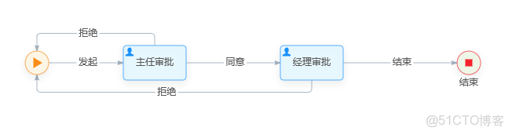

> **About this post**
>
> Build the ops platform workflow frontend based on the open-source flow designer `wfd-vue`: configure nodes, approvers, candidate groups, and other data on a Vue page, export the JSON structure via `graph.save()` and pass it to the backend for storage, implementing a simple ticket flow of "initiate - director approval - manager approval - end".

> **Technical notes**
>
> This example was written with `wfd-vue` (originally the GitHub repository `guozhaolong/wfd-vue`) and Vue 2; the original link was truncated, and the full address is https://github.com/guozhaolong/wfd-vue. The project has not been updated for years, and Vue 2 is EOL as well; for production, consider migrating to more actively maintained workflow frontend solutions such as Vue 3 + bpmn-js / AntV X6.

---

### Ops Platform Workflow - A Simple Example

#### Introduction

> Based on https://github.com/guozhaolong/wfd-vue

> The frontend is Vue; the backend is Python or Go. The following is mainly a frontend example.

#### Frontend

```shell
git clone https://github.com/guozhaolong/wfd-vue
npm run serve
```

- example/App.vue

```vue
<template>
  <div id="app">
    <el-button size="small" style="float:right;margin-top:6px;margin-right:6px;" @click="add">导出json</el-button>
    <wfd-vue ref="wfd" :data="demoData" :height="600" :users="candidateUsers" :groups="candidateGroups" :categorys="categorys" :lang="lang" />
  </div>
</template>

<script>
import WfdVue from '../src/components/Wfd'
export default {
  name: 'app',
  components:{
    WfdVue
  },
  data () {
    return {
      modalVisible:false,
      lang: "zh",
      demoData: {
        nodes: [{ id: 'startNode1', x: 50, y: 200, label: '', clazz: 'start', },
          { id: 'taskNode1', x: 200, y: 200, label: '主任审批', clazz: 'userTask',  },
          { id: 'taskNode2', x: 400, y: 200, label: '经理审批', clazz: 'userTask',  },
          { id: 'endNode', x: 600, y: 200, label: '结束', clazz: 'end', }],
        edges: [{ source: 'startNode1', target: 'taskNode1', sourceAnchor:1, targetAnchor:3, clazz: 'flow',label:"发起" },
          { source: 'taskNode1', target: 'startNode1', sourceAnchor:0, targetAnchor:0, clazz: 'flow',label:"拒绝"  },
          { source: 'taskNode1', target: 'taskNode2', sourceAnchor:1, targetAnchor:3, clazz: 'flow' ,label:"同意" },
          { source: 'taskNode2', target: 'startNode1', sourceAnchor:2, targetAnchor:2, clazz: 'flow',label:"拒绝"  },
          { source: 'taskNode2', target: 'endNode', sourceAnchor:1, targetAnchor:3, clazz: 'flow' ,label:"结束" }]
      },
      candidateUsers: [{id:'1',name:'审批人1'},{id:'2',name:'审批人2'},{id:'3',name:'审批人3'}],
      candidateGroups: [{id:'1',name:'组1'},{id:'2',name:'组2'},{id:'3',name:'组3'}],
      categorys: [{id:'1',name:'分类1'},{id:'2',name:'分类2'},{id:'3',name:'分类3'}],
    }
  },
  mounted() {
  },
  methods:{
     add (){
       console.log(JSON.stringify(this.$refs['wfd'].graph.save()))
     }
  }
}
</script>

<style>
#app {
  font-family: 'Avenir', Helvetica, Arial, sans-serif;
  -webkit-font-smoothing: antialiased;
  -moz-osx-font-smoothing: grayscale;
  text-align: center;
  color: #2c3e50;
}
</style>
```



#### Exporting JSON

> Below is the exported JSON data, which can be passed to the backend for storage.

```json
{"nodes":[{"shape":"start-node","id":"startNode1","x":50,"y":200,"label":"","clazz":"start","style":{},"size":[30,30]},{"shape":"user-task-node","id":"taskNode1","x":200,"y":200,"label":"主任审批","clazz":"userTask","style":{},"size":[80,44]},{"shape":"user-task-node","id":"taskNode2","x":400,"y":200,"label":"经理审批","clazz":"userTask","style":{},"size":[80,44]},{"shape":"end-node","id":"endNode","x":600,"y":200,"label":"结束","clazz":"end","style":{},"size":[30,30]}],"edges":[{"source":"startNode1","target":"taskNode1","sourceAnchor":1,"targetAnchor":3,"clazz":"flow","label":"发起","shape":"flow-polyline-round","id":"edge1","style":{},"startPoint":{"x":65.5,"y":200,"index":1},"endPoint":{"x":159.5,"y":200,"index":3}},{"source":"taskNode1","target":"startNode1","sourceAnchor":0,"targetAnchor":0,"clazz":"flow","label":"拒绝","shape":"flow-polyline-round","id":"edge2","style":{},"startPoint":{"x":200,"y":177.5,"index":0},"endPoint":{"x":50,"y":184.5,"index":0}},{"source":"taskNode1","target":"taskNode2","sourceAnchor":1,"targetAnchor":3,"clazz":"flow","label":"同意","shape":"flow-polyline-round","id":"edge3","style":{},"startPoint":{"x":240.5,"y":200,"index":1},"endPoint":{"x":359.5,"y":200,"index":3}},{"source":"taskNode2","target":"startNode1","sourceAnchor":2,"targetAnchor":2,"clazz":"flow","label":"拒绝","shape":"flow-polyline-round","id":"edge4","style":{},"startPoint":{"x":400,"y":222.5,"index":2},"endPoint":{"x":50,"y":215.5,"index":2}},{"source":"taskNode2","target":"endNode","sourceAnchor":1,"targetAnchor":3,"clazz":"flow","label":"结束","shape":"flow-polyline-round","id":"edge5","style":{},"startPoint":{"x":440.5,"y":200,"index":1},"endPoint":{"x":584.5,"y":200,"index":2,"anchorIndex":2}}],"combos":[],"groups":[]}
```

#### Ticket Flow

> Create a basic ticket. You can use the ticket generator to generate one directly.

> Then bind the ticket to the workflow above. After the ticket is initiated, the state moves to taskNode1, i.e. director approval. At this step, check the edges whose source is taskNode1 - there are two in total: one for approve, one for reject. Then let the approver choose.

> After the approver chooses, update the ticket state, and so on.

#### Backend

- To be added
