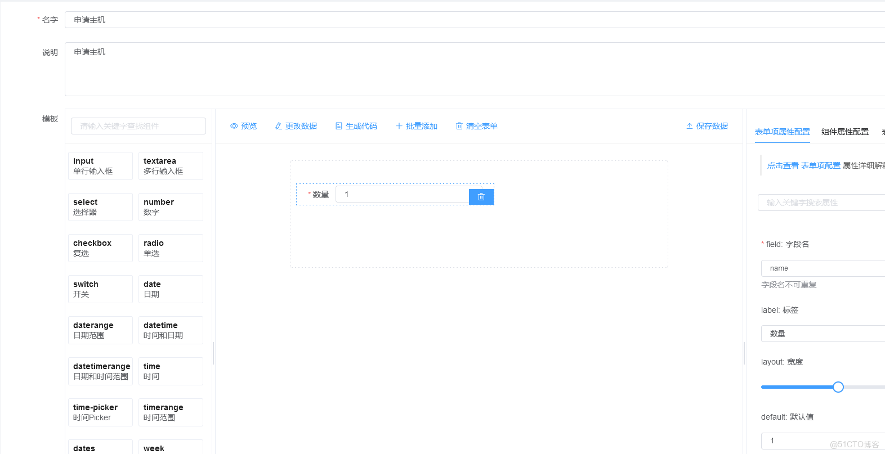
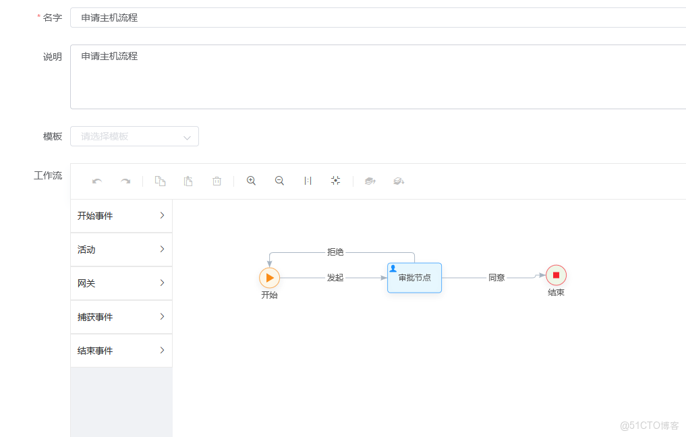
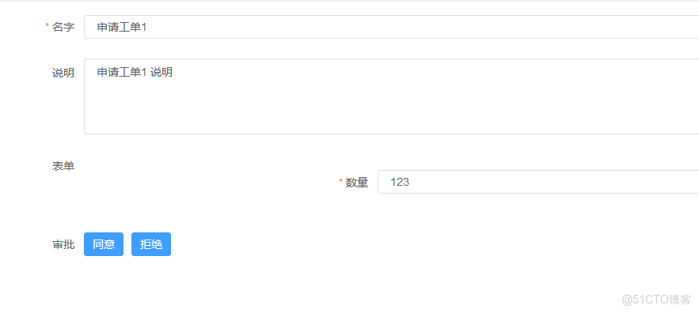

> **About this post**
>
> This post introduces a development model for a workflow platform built on Go + Vue: use `form-create` as a form generator to design business models, use `wfd-vue` to draw approval workflows and link the model to the workflow, and finally generate work orders from workflow nodes with dynamically rendered forms — covering the complete chain from modeling to work-order circulation.

> **Technical notes**
>
> The examples are written with `form-create` and `wfd-vue` (Vue 2 ecosystem); neither has been actively updated for years, and Vue 2 has reached EOL. For new projects, consider mainstream alternatives such as Vue 3 + the latest `form-create` + `bpmn-js` / `AntV X6`.

---

> go vue workflow development model

### Architecture

> Model
> Workflow
> Work order

### Steps

> Model    Build a form generator with the `form-create` module. There are plenty of such modules to choose from.
> 

> Use the `wfd-vue` module to build a workflow form, and associate the model above with the workflow.
> 

> Generate work orders based on the workflow. Here `form-create` is also used to turn the form JSON into an actual form.
> 
> 
> 
