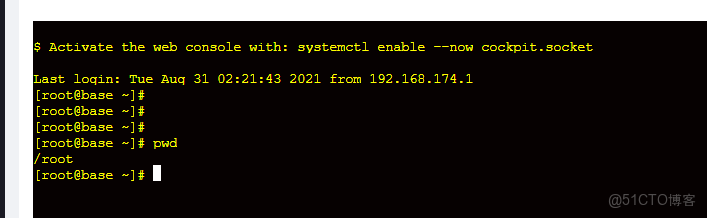

> **About this post**
>
> Build a WebSSH frontend based on Vue + xterm.js 4.x: after the page loads, it connects to the Go/Gin backend over WebSocket, initializes the terminal and loads the `AttachAddon` and `FitAddon` plugins, wraps user input into a JSON command (`Op: stdin`) and sends it to the backend, then renders the returned terminal stream onto the xterm canvas.

> **Technical notes**
>
> The example is written against xterm.js 4.x; starting with xterm.js 5.x the API and plugin package names have changed (e.g. `@xterm/xterm`, `@xterm/addon-fit`), and `rendererType: "canvas"` is deprecated. The GitHub link in the original post was truncated; the full address is https://github.com/hequan2017/go-webssh.

---

### Screenshot



### Frontend

```vue
<template>
  <div>
    <div id="log" style="margin-top:20px;">
      </div>

  </div>
</template>
<script>
import {findConfig} from "@/api/config";
import "xterm/css/xterm.css";
import { Terminal } from "xterm";
import { FitAddon } from "xterm-addon-fit";
import { AttachAddon } from "xterm-addon-attach";

export default {
  components: {},
  props: {
    socketURI: {
      type: String,
      default: ""
    }
  },
  data() {
    return {
      term: null,
      socket: null,
      rows: 40,
      // cols: 10,
      SetOut: false,
      isKey: false
    }
  },
  computed: {},
  watch: {},
  created() {
    const id = this.$route.query.id
    const res = findConfig({ID: id}).then(data => {
       =
    });

  },
  mounted() {
    this.initSocket();
  },
  beforeDestroy () {
    this.socket.close();
    // this.term.dispose();
  },
  methods: {
    submitForm() {
      this.$refs['elForm'].validate(valid => {
        if (!valid) return
        // TODO submit form
      })
    },
    resetForm() {
      this.$refs['elForm'].resetFields()
    },
    //Xterm theme
    initTerm () {
      const term = new Terminal({
        rendererType: "canvas", // render type
        rows: this.rows, // number of rows
        // cols: this.cols,// once set, typing multiple lines causes overwriting
        convertEol: true, // when enabled, the cursor is set to the beginning of the next line
        // scrollback: 10,// amount of scrollback in the terminal
        fontSize: 14, // font size
        disableStdin: false, // whether input should be disabled
        cursorStyle: "block", // cursor style
        // cursorBlink: true, // cursor blink
        scrollback: 30,
        tabStopWidth: 4,
        theme: {
          foreground: "yellow", // font
          background: "#060101", // background color
          cursor: "help" // set cursor
        }
      });
      const attachAddon = new AttachAddon(this.socket);
      const fitAddon = new FitAddon();
      term.loadAddon(attachAddon);
      term.loadAddon(fitAddon);
      term.open(document.getElementById("terminal"));
      // fitAddon.fit();
      term.focus();
      let _this = this;
      // limit interaction with the backend: the result shows only when Enter is pressed
      term.prompt = () => {
        term.write("\r\n$ ");
      };
      term.prompt();
      function runFakeTerminal (_this) {
        if (term._initialized) {
          return;
        }
        // initialize
        term._initialized = true;
        term.writeln();// where the console throws an error during initialization
        term.prompt();
        // / **
        //     * Adds an event listener for when a key is pressed. The event value contains
        //     * the string that will be sent in the data event as well as the DOM event
        //     * that triggered it.
        //     * @returns an IDisposable to stop listening.
        //  * /
        //   / ** Update: xterm 4.x (new)
        //  * Adds an event listener for when the data event fires. This happens
        //  * when the user types or pastes into the terminal, for example. The event value
        //  * is the resulting `string`, which in a typical setup should be passed on
        //  * to the backing pty.
        //  * @returns an IDisposable to stop listening.
        //  * /
        // support typing and pasting
        term.onData(function (key) {
          let order = {
            Data: key,
            Op: "stdin"
          };
          _this.onSend(order);
        });
        _this.term = term;
      }
      runFakeTerminal(_this);
    },
    //webShell theme
    initSocket () {
      const WebSocketUrl = "ws://localhost:8888/base/ws"
      this.socket = new WebSocket(
          WebSocketUrl
      );
      this.socketOnClose(); // close
      this.socketOnOpen(); //
      this.socketOnError();
    },
    // what to do after the webshell connects successfully
    socketOnOpen () {
      this.socket.onopen = () => {
        // connection succeeded
        this.initTerm();
      };
    },
    // what to do after the webshell closes
    socketOnClose () {
      this.socket.onclose = () => {
        console.log("close socket");
      };
    },
    // webshell error message
    socketOnError () {
      this.socket.onerror = () => {
        console.log("socket 链接失败");
      };
    },
    // special handling
    onSend (data) {
      data = this.base.isObject(data) ? JSON.stringify(data) : data;
      data = this.base.isArray(data) ? data.toString() : data;
      data = data.replace(/\\\\/, "\\");
      this.shellWs.onSend(data);
    },
    // trim whitespace on both ends
    trim (str) {
      return str.replace(/(^\s*)|(\s*$)/g, "");
    }
  }
}

</script>
<style>
</style>
```

### Address

> Backend address ws://localhost:8888/base/ws

### Backend

```go
BaseRouter.GET("ws", v1.WsSsh)
```

> You can refer to my project https://github.com/hequan2017/go-webssh
