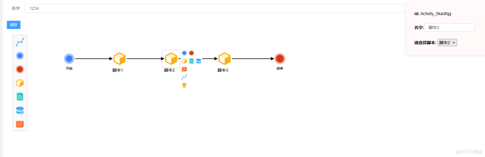
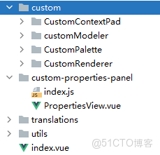

> **About this post**
>
> A custom pipeline designer built with Vue + bpmn-js: CustomModeler, CustomContextPad, and CustomRenderer replace the default modeler behavior, and a custom properties panel (PropertiesView) is mounted, letting users drag a "start — script task — end" orchestration flow onto the canvas. On save, `saveXML` exports the BPMN XML, which is submitted together with the name to the backend to create or update the record; the backend parses the XML with Go's etree library and extracts the id/name/shell attributes of each task node for subsequent scheduling and execution.

> **Technical notes**
>
> The example follows the CommonJS style of the bpmn-js 7.x/8.x era (`bpmn-js/lib/Modeler`, `bpmn-js-properties-panel/lib/provider/camunda`). Starting with bpmn-js 9.x the library has fully moved to ESM and the properties-panel directory structure has been reworked, so import paths need to be adjusted accordingly in newer versions; the callback-style `importXML` call has also become Promise-based in newer versions. The actual import path of the etree library the backend uses to parse XML is `github.com/beevik/etree` — it was truncated when the original post was scraped and has been corrected here.

---



### Just follow the tutorial

> [https://juejin.cn/post/6844904017567416328](https://juejin.cn/post/6844904017567416328)

```vue
<template>

  <div class="containers">
    <div>
      <el-form :model="formData" label-position="right" label-width="60px">
        <el-form-item label="名字:">
          <el-input v-model="" clearable placeholder="请输入" />
        </el-form-item>
      </el-form>
    </div>
    <el-button size="mini" type="primary"  @click="open">保存</el-button>
    <!--    -->
    <properties-view v-if="bpmnModeler" :modeler="bpmnModeler"></properties-view>
  </div>

</template>

<script>
import {
  createBpmn,
  deleteBpmn,
  deleteBpmnByIds,
  updateBpmn,
  findBpmn,
  getBpmnList
} from '@/api/bpmn' //  Replace the URL here with your own
import BpmnModeler from 'bpmn-js/lib/Modeler'
import propertiesPanelModule from 'bpmn-js-properties-panel'
import propertiesProviderModule from 'bpmn-js-properties-panel/lib/provider/camunda'
// import camundaModdleDescriptor from 'camunda-bpmn-moddle/resources/camunda'
import CustomModeler from './custom/customModeler'
import contextPadProvider  from './custom/CustomContextPad'
import CustomRenderer from './custom/CustomRenderer'

import { mapGetters } from 'vuex'
import customTranslate from "./translations";
import {createDataItem} from "@/api/dataItem";
import {findConfigexeclog} from "@/api/configexeclog";
// Custom properties-panel content
// import propertiesProviderModule from './properties-panel-extension/provider/authority';
// import authorityModdleDescriptor from './properties-panel-extension/descriptors/authority'
import PropertiesView from './custom-properties-panel/PropertiesView'

var customTranslateModule = {
  translate: ['value', customTranslate]
};

export default {
  name: 'bpmncreate',
  components: {
    PropertiesView
  },
  data() {
    return {
      bpmnModeler: null,
      container: null,
      canvas: null,
      formData:{
        name:'',
        text:'',
      }

    }
  },
  created() {
    const id = this.$route.query.id
    if (id){
      const res = findBpmn({ID: id}).then(data => {
        this.formData = data.data.rebpmn
        this.createNewDiagram()
      });
    }
  },
  mounted(){
    const canvas = this.$refs.canvas
    // Modeling
    this.bpmnModeler = new CustomModeler({
      container: canvas,
      // Attach the properties panel
      propertiesPanel: {
        parent: '#js-properties-panel'
      },
      additionalModules: [
        propertiesProviderModule,
        // propertiesPanelModule,  // original, right side
        contextPadProvider,
        CustomRenderer,
        customTranslateModule
      ],
      moddleExtensions: {
        // camunda: camundaModdleDescriptor
        // authority: authorityModdleDescriptor  // right side, commented out
      }
    })
    this.createNewDiagram()
  },
  computed: {
    ...mapGetters('user', ['userInfo'])
  },
  methods: {
    createNewDiagram () {
      let bpmnXmlStr = ''
      if (this.formData.text === ""){
        bpmnXmlStr = `
      <?xml version="1.0" encoding="UTF-8"?>
        <bpmn2:definitions xmlns:bpmn2="http://www.omg.org/spec/BPMN/20100524/MODEL" xmlns:xsi="http://www.w3.org/2001/XMLSchema-instance" xmlns:bpmndi="http://www.omg.org/spec/BPMN/20100524/DI" xmlns:dc="http://www.omg.org/spec/DD/20100524/DC" id="sample-diagram" targetNamespace="http://bpmn.io/schema/bpmn" xsi:schemaLocation="http://www.omg.org/spec/BPMN/20100524/MODEL BPMN20.xsd">
          <bpmn2:process id="a12345" name="">
          </bpmn2:process>
          <bpmndi:BPMNDiagram id="">
            <bpmndi:BPMNPlane id="" bpmnElement="">

            </bpmndi:BPMNPlane>
          </bpmndi:BPMNDiagram>
        <processType id="test"/></bpmn2:definitions>
      `
      }else{
        bpmnXmlStr = this.formData.text
      }
      this.bpmnModeler.importXML(bpmnXmlStr, (err) => {
        if (err) {
          console.error(err)
        }
      })
    },

    open () {
      if( this.formData.name === ""){
        this.$message({
          type: 'error',
          message: '名字不能为空,未保存！请输入名字后,再保存！'
        })
        return
      }

      const that = this
      that.saveDiagram(async function (err, xml) {
        const id = that.$route.query.id
        if (!id){
          const res = await createBpmn({"text":xml,"name":that.formData.name})
          if (res["code"]=== 0 ){
            that.$message({
              type: 'success',
              message: '创建提交成功!'
            })
          }else{
            that.$message({
              type: 'error',
              message: '创建提交失败!'
            })
          }
        }else{
          that.formData.text=xml
          const res = await updateBpmn(that.formData)
          if (res["code"]=== 0 ){
            that.$message({
              type: 'success',
              message: '更新提交成功!'
            })
          }else{
            that.$message({
              type: 'error',
              message: '更新提交失败!'
            })
          }
        }

      })

    },
    // Download as BPMN format; done is a callback passed in by the caller
    saveDiagram(done) {
      // Pass the done callback through to bpmn's prototype saveXML
      this.bpmnModeler.saveXML({ format: true }, function(err, xml) {
        done(err, xml)
      })
    }
  }
}
</script>

<style scoped>

@import '~bpmn-js/dist/assets/diagram-js.css';
@import '~bpmn-js/dist/assets/bpmn-font/css/bpmn.css';
@import '~bpmn-js/dist/assets/bpmn-font/css/bpmn-codes.css';
@import '~bpmn-js/dist/assets/bpmn-font/css/bpmn-embedded.css';

.containers{
  position: absolute;
  background-color: #ffffff;
  width: 100%;
  height: 100%;
}
.canvas{
  width: 100%;
  height: 100%;
}
.panel{
  position: absolute;
  right: 0;
  top: 0;
  width: 600px;
}
</style>
```



### Generated XML

```xml
<?xml version="1.0" encoding="UTF-8"?>
<bpmn2:definitions xmlns:bpmn2="http://www.omg.org/spec/BPMN/20100524/MODEL" xmlns:xsi="http://www.w3.org/2001/XMLSchema-instance" xmlns:bpmndi="http://www.omg.org/spec/BPMN/20100524/DI" xmlns:dc="http://www.omg.org/spec/DD/20100524/DC" xmlns:di="http://www.omg.org/spec/DD/20100524/DI" id="sample-diagram" targetNamespace="http://bpmn.io/schema/bpmn" xsi:schemaLocation="http://www.omg.org/spec/BPMN/20100524/MODEL BPMN20.xsd">
    <bpmn2:process id="a123456" name="脚本112222">
        <bpmn2:startEvent id="Event_05qt21g" name="开始">
            <bpmn2:outgoing>Flow_1t09x1a</bpmn2:outgoing>
        </bpmn2:startEvent>
        <bpmn2:task id="Activity_1ictc73" name="脚本1" shell="脚本1">
            <bpmn2:incoming>Flow_1t09x1a</bpmn2:incoming>
            <bpmn2:outgoing>Flow_0s57kw1</bpmn2:outgoing>
        </bpmn2:task>
        <bpmn2:sequenceFlow id="Flow_1t09x1a" sourceRef="Event_05qt21g" targetRef="Activity_1ictc73" />
        <bpmn2:task id="Activity_0ka4fqg" name="脚本2" shell="脚本2">
            <bpmn2:incoming>Flow_0s57kw1</bpmn2:incoming>
            <bpmn2:outgoing>Flow_00gs2sy</bpmn2:outgoing>
        </bpmn2:task>
        <bpmn2:sequenceFlow id="Flow_0s57kw1" sourceRef="Activity_1ictc73" targetRef="Activity_0ka4fqg" />
        <bpmn2:task id="Activity_0l7dnwm" name="脚本3" shell="脚本3">
            <bpmn2:incoming>Flow_00gs2sy</bpmn2:incoming>
            <bpmn2:outgoing>Flow_1qn797p</bpmn2:outgoing>
        </bpmn2:task>
        <bpmn2:sequenceFlow id="Flow_00gs2sy" sourceRef="Activity_0ka4fqg" targetRef="Activity_0l7dnwm" />
        <bpmn2:endEvent id="Event_0f2wok6" name="结束">
            <bpmn2:incoming>Flow_1qn797p</bpmn2:incoming>
        </bpmn2:endEvent>
        <bpmn2:sequenceFlow id="Flow_1qn797p" sourceRef="Activity_0l7dnwm" targetRef="Event_0f2wok6" />
    </bpmn2:process>
    <bpmndi:BPMNDiagram id="">
        <bpmndi:BPMNPlane id="" bpmnElement="a123456">
            <bpmndi:BPMNEdge id="Flow_1t09x1a_di" bpmnElement="Flow_1t09x1a">
                <di:waypoint x="230" y="100" />
                <di:waypoint x="356" y="100" />
            </bpmndi:BPMNEdge>
            <bpmndi:BPMNEdge id="Flow_0s57kw1_di" bpmnElement="Flow_0s57kw1">
                <di:waypoint x="404" y="100" />
                <di:waypoint x="530" y="100" />
            </bpmndi:BPMNEdge>
            <bpmndi:BPMNEdge id="Flow_00gs2sy_di" bpmnElement="Flow_00gs2sy">
                <di:waypoint x="578" y="100" />
                <di:waypoint x="710" y="100" />
            </bpmndi:BPMNEdge>
            <bpmndi:BPMNEdge id="Flow_1qn797p_di" bpmnElement="Flow_1qn797p">
                <di:waypoint x="758" y="100" />
                <di:waypoint x="900" y="100" />
            </bpmndi:BPMNEdge>
            <bpmndi:BPMNShape id="Event_05qt21g_di" bpmnElement="Event_05qt21g">
                <dc:Bounds x="190" y="80" width="40" height="40" />
                <bpmndi:BPMNLabel>
                    <dc:Bounds x="199" y="127" width="22" height="14" />
                </bpmndi:BPMNLabel>
            </bpmndi:BPMNShape>
            <bpmndi:BPMNShape id="Activity_1ictc73_di" bpmnElement="Activity_1ictc73">
                <dc:Bounds x="356" y="76" width="48" height="48" />
            </bpmndi:BPMNShape>
            <bpmndi:BPMNShape id="Activity_0ka4fqg_di" bpmnElement="Activity_0ka4fqg">
                <dc:Bounds x="530" y="76" width="48" height="48" />
            </bpmndi:BPMNShape>
            <bpmndi:BPMNShape id="Activity_0l7dnwm_di" bpmnElement="Activity_0l7dnwm">
                <dc:Bounds x="710" y="76" width="48" height="48" />
            </bpmndi:BPMNShape>
            <bpmndi:BPMNShape id="Event_0f2wok6_di" bpmnElement="Event_0f2wok6">
                <dc:Bounds x="900" y="80" width="40" height="40" />
                <bpmndi:BPMNLabel>
                    <dc:Bounds x="909" y="127" width="22" height="14" />
                </bpmndi:BPMNLabel>
            </bpmndi:BPMNShape>
        </bpmndi:BPMNPlane>
    </bpmndi:BPMNDiagram>
</bpmn2:definitions>
```

### Write the parser on the backend

```go
package main

import (
    "fmt"

    "github.com/beevik/etree"
)

func main() {
    doc := etree.NewDocument()
    if err := doc.ReadFromFile("test/1.xml"); err != nil {
        panic(err)
    }
    root := doc.SelectElement("bpmn2:definitions")
    fmt.Println("ROOT element:", root.Tag)
    for _, book := range root.SelectElements("bpmn2:process") {
        fmt.Println("CHILD element:", book.Tag)
            if title := book.SelectElement("bpmn2:task"); title != nil {
                id := title.SelectAttrValue("id", "unknown")
                name := title.SelectAttrValue("name", "unknown")
                shell := title.SelectAttrValue("shell", "unknown")
                fmt.Println(id,name,shell)
                for _, attr := range title.Attr {
                    fmt.Printf("  ATTR: %s=%s\n", attr.Key, attr.Value)
                }
            }

    }
}
```
