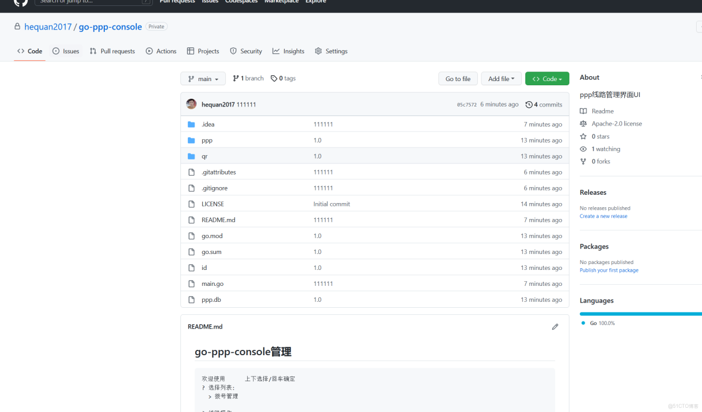

> **About this post**
>
> This post is the v0.1 release note of the dial-up management system
> series: the author has uploaded the project code to GitHub, and the
> body gives the search keyword `go-ppp-console`, along with a
> screenshot of the repository page (a PPP line management UI written
> in Go), so readers can locate the source repository by that keyword
> and read it alongside the hands-on code posts that follow.

> **Technical notes**
>
> The screenshot shows the repository is hequan2017/go-ppp-console
> (About: ppp line management UI, Go 100%, Apache-2.0); it was still
> Private at the time and may not be publicly accessible now. Its
> ppp/ directory (CRUD with gorm) and qr/ directory (a termdash
> terminal UI) correspond exactly to the code posted in the series'
> "go-ppp CRUD" and "UI input box" posts.

---

```text
github 关键词       go-ppp-console
```


